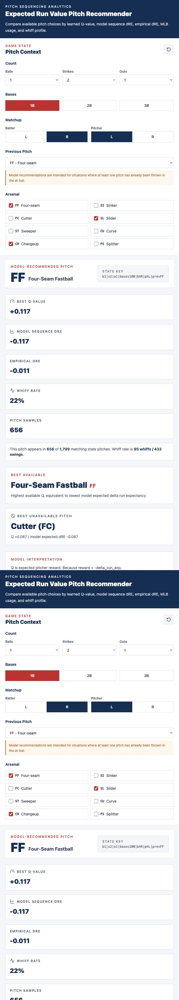

# Expected Run Value Pitch Recommender

Interactive baseball pitch sequencing dashboard powered by a FastAPI recommendation engine and a Next.js frontend. The app uses an exported reinforcement-learning Q-table plus precomputed Statcast metrics to recommend the best available pitch for a game state.



## What It Does

- Recommends the best available pitch from a selected arsenal.
- Compares every pitch by learned Q-value, model-implied delta run expectancy, observed Statcast delta run expectancy, MLB usage, whiff rate, batting average against, and sample size.
- Shows the best overall pitch even when it is not in the selected arsenal, which helps frame arsenal design questions.
- Includes a dashboard key explaining the chart and table values.

The model currently expects at least one pitch to have already been thrown in the at-bat because `prev_pitch` is part of the state encoding.

## Tech Stack

- Backend: FastAPI, pandas, numpy, pickle
- Frontend: Next.js, React, Tailwind CSS, Recharts
- Model artifacts: exported Q-table and precomputed Statcast metric lookup tables

## Project Structure

```text
backend/
  app.py
  model/
    encoder.py
    metrics.py
    metrics.pkl
    pitch_mappings.py
    q_table.pkl
    recommend.py
  export_q_artifacts.py
  smoke_test.py
  train_and_export_q_table.py
frontend/
  app/
  components/
    ComparisonPanel.tsx
    ControlPanel.tsx
    RecommendationPanel.tsx
    ValueKey.tsx
  lib/
dashboard-screenshot.png
```

## Run Backend

```bash
cd backend
python3 -m venv .venv
source .venv/bin/activate
pip install -r requirements.txt
uvicorn app:app --reload --port 8000
```

Health check:

```bash
curl http://127.0.0.1:8000/health
```

## Run Frontend

From the project root:

```bash
source use-node.sh
cd frontend
npm run dev
```

Open `http://localhost:3000`.

This workspace includes a project-local Node/npm install under `.tools/node`. If you open a new shell from the project root, run:

```bash
source use-node.sh
npm --version
```

## API Example

```http
POST /recommend
```

```json
{
  "balls": 1,
  "strikes": 2,
  "outs": 1,
  "on_1b": true,
  "on_2b": false,
  "on_3b": false,
  "batter_hand": "R",
  "pitcher_hand": "L",
  "prev_pitch": "FF",
  "available_pitches": ["FF", "SL", "CH"]
}
```

Important response values:

```text
best_q_value = max(Q(state, pitch))
best_expected_delta_run_exp = -best_q_value
empirical_delta_run_exp = observed Statcast average delta_run_exp
```

Higher Q is better for the pitcher. Lower delta run expectancy is better for the pitcher.

## Dashboard Value Key

- `Q`: learned model reward for the pitcher in the selected state.
- `Model Seq dRE`: delta run expectancy implied by the learned Q-value.
- `Emp dRE`: observed average Statcast delta run expectancy for the same state and pitch.
- `MLB%`: how often MLB pitchers used that pitch in matching states.
- `Weight`: normalized model preference from Q-values; useful for comparison, not a true probability.
- `Whiff%`: whiffs divided by swings for matching state and pitch samples.
- `Pitch N`: number of Statcast pitches behind the observed metrics.

## Notebook Export

The corrected notebook copy lives at:

```text
backend/Spring26BaseballProj_Corrected.ipynb
```

After training `agent_aug` in the notebook, export the Q-table for the API:

```python
from export_q_artifacts import export_augmented_q_table

export_augmented_q_table(agent_aug, IDX_TO_PITCH)
```

The dashboard reads the exported artifacts from:

```text
backend/model/q_table.pkl
backend/model/metrics.pkl
```

## Verification

Backend smoke test:

```bash
cd backend
source .venv/bin/activate
python smoke_test.py
```

Frontend build:

```bash
source use-node.sh
cd frontend
npm run build
```
